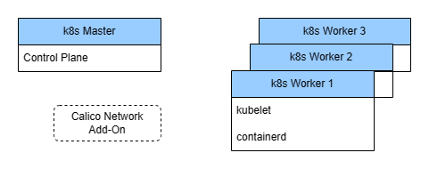

# k8s Cluster Setup on Ubuntu for Home Lab

- k8s Cluster Diagram
- 

- Clone or download this repository to your k8s master node.

- Grant the user execute permission to all scripts within the downloaded repository directory.
  ```bash
  chmod u+x *.sh
  ```

- Run **k8s_cluster_setup.sh** in your k8s master node.
  ```bash
  ./k8s_cluster_setup.sh
  ```

- Provide your Ubuntu version (20.04 or 22.04) then the script will install and configure all the necessary components for the control plane on your master node.

- Afterward, provide the username and IP address of your worker node, and the script will handle all the necessary installations and steps to join the worker node to the k8s cluster.

- You can join more than one worker node.

- Sample Output
  ```bash
  Please choose your ubuntu version (20-04 or 22-04):
  ....
  ....
  ....
  Please enter your workernode username:
  Please enter your workernode ip:
  ....
  ....
  ....
  Do you want to join another worker node (Y/y/N/n):
  ....
  ....
  ....
  ````
